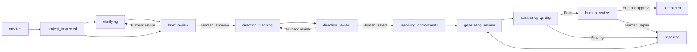

# Meridian UI Generation Session Model 0.1

- Status: Implemented foundation
- Policy: `design/ui-generation-session-policy.json`
- Session schema: `schemas/ui-generation-session.schema.json`
- Policy schema: `schemas/ui-generation-session-policy.schema.json`
- Semantic validator: `scripts/lib/ui-generation-session.mjs`
- Reference session: `examples/ui-generation/session-foundation.session.json`

## 1. Purpose

UI Generation Sessionは、User RequestからGeneration Reportまでの進行状態、入力、判断、生成物、品質Evidenceを結び付けるworkflowの正本である。

個別artifactの内容はそれぞれのschemaが所有する。Sessionは内容を複製せず、repository-relative path、artifact type、schema version、revision、ownership、status、SHA-256 digestを保持する。これにより、後からartifactが変更された場合に、過去の生成やHuman Approvalが別の内容を参照していることを検出できる。

## 2. State flow

すべての非Terminal stateから、明示的な`cancel_session`または`fail_session`へ進める。`cancelled`と`failed`は成功を意味しない。成功Terminal stateは`completed`だけである。

## 3. Artifact ownership

| Ownership | Meaning | Examples |
|---|---|---|
| `canonical` | Human Decisionや後続生成の入力となる正本 | Design Brief、Requirement Allocation、Direction Set、Capability Plan |
| `derived` | 正本から再生成でき、手編集しない成果物 | Adapter Resolution、Review UI、Generation Report |
| `evidence` | 判断や品質主張を裏付ける観測結果 | Project Context、Browser Quality Report |

同じartifact typeにはcurrent artifactを1件だけ持てる。current artifactはそのtypeで最大revisionでなければならない。古いrevisionは削除せず`superseded`として保持できる。

## 4. Transition rules

State transitionは次をすべて満たす場合だけ有効になる。

1. 現在stateから許可されたtransitionである。
2. Transition historyが直前のdestinationから連続している。
3. Destination stateとtransition固有の必須artifactがすべてcurrentである。
4. Transition recordが必須artifactの正確なdigestをbindしている。
5. Human Gateでは、必要roleを持つHuman Approvalが存在する。
6. Human Approvalも、レビュー対象となった必須artifactの正確なdigestをbindしている。
7. Sessionの現在stateが最後のtransition destinationと一致する。

AIまたはsystem actorがHuman Gateを実行することはできない。Human Approval後に必須artifactのrevisionやdigestが変わると、その承認はstaleになり、Session validationは失敗する。

## 5. Integrity and failure behavior

- Artifact pathはrepository-relativeに限定する。
- `..`またはabsolute pathによるrepository外参照を拒否する。
- current artifactの実ファイルが存在し、記録されたSHA-256 digestと一致することを必須にする。
- TransitionとApprovalから存在しないartifactへの参照を拒否する。
- Approvalの再利用、未使用Approval、役割不一致、AI Approvalを拒否する。
- Transition timestampの逆行とSession revisionの不足を拒否する。
- Open blockerは`blocksTransitions`で対象transitionを明示し、解決前の実行を拒否する。
- `completed`状態にopen blockerを残せない。
- RepairにはStructured FeedbackとRepair Planを必須とし、派生HTMLだけの黙示的修正を認めない。

## 6. Current integration boundary

`scripts/validate-system.mjs`は、Session Policyと`examples/ui-generation/*.session.json`をschema・semanticの両方で検証する。

M0.3ではstateとartifact contractを実装した。既存Phase 1 Package、ScreenSpec、FlowSpec、Phase 2 Concept、Composition、Usage、Visual Reviewをどのartifact typeとrevisionへ対応付けるかはM0.4のmigration mapで定義する。
